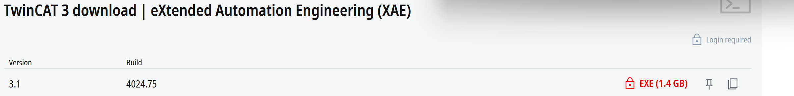

## 软件下载及安装

在安装 PLC 开发环境之前，建议先安装 Visual Studio，这样在后续安装 TwinCAT 3 时，可以自动识别并集成对应的 Visual Studio 版本，便于编写 PLC 程序。

Visual Studio 各版本 Community（社区版）下载地址如下：

- [Visual Studio 2017 Community](https://visualstudio.microsoft.com/zh-hans/thank-you-downloading-visual-studio/?sku=Community&rel=15)
- [Visual Studio 2019 Community](https://visualstudio.microsoft.com/thank-you-downloading-visual-studio/?sku=community&rel=16&utm_medium=microsoft&utm_campaign=download+from+relnotes&utm_content=vs2019ga+button)
- [Visual Studio 2022 Community](https://visualstudio.microsoft.com/zh-hans/thank-you-downloading-visual-studio/?sku=Community&channel=Release&version=VS2022&source=VSLandingPage&cid=2030&passive=false)

安装 Visual Studio 时，请注意在“工作负载”中勾选 **“使用 C++ 的桌面开发”**，因为 TwinCAT 3 的 PLC 编程环境依赖该组件。

Visual Studio 安装完成后，接下来需要安装 TwinCAT 3 软件，它是编写和运行 PLC 程序的核心开发平台。

TwinCAT 3 下载地址：  
[https://www.beckhoff.com/en-en/support/download-finder/search-result/?c-1=26782567](https://www.beckhoff.com/en-en/support/download-finder/search-result/?c-1=26782567)

TwinCAT 3 的安装过程较为简单，通常情况下保持默认选项，一路“Next”即可完成安装。