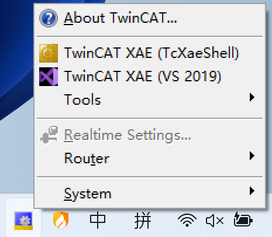
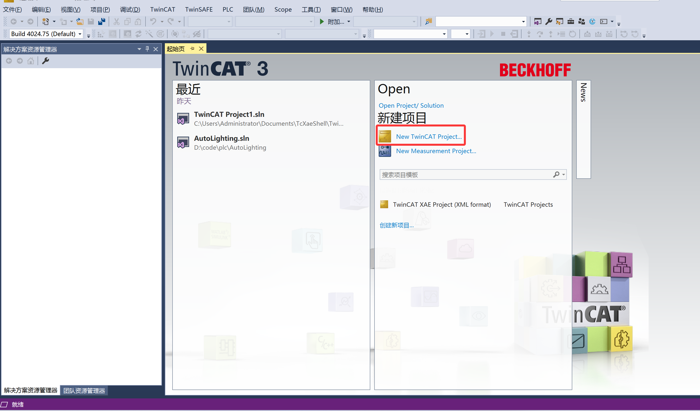
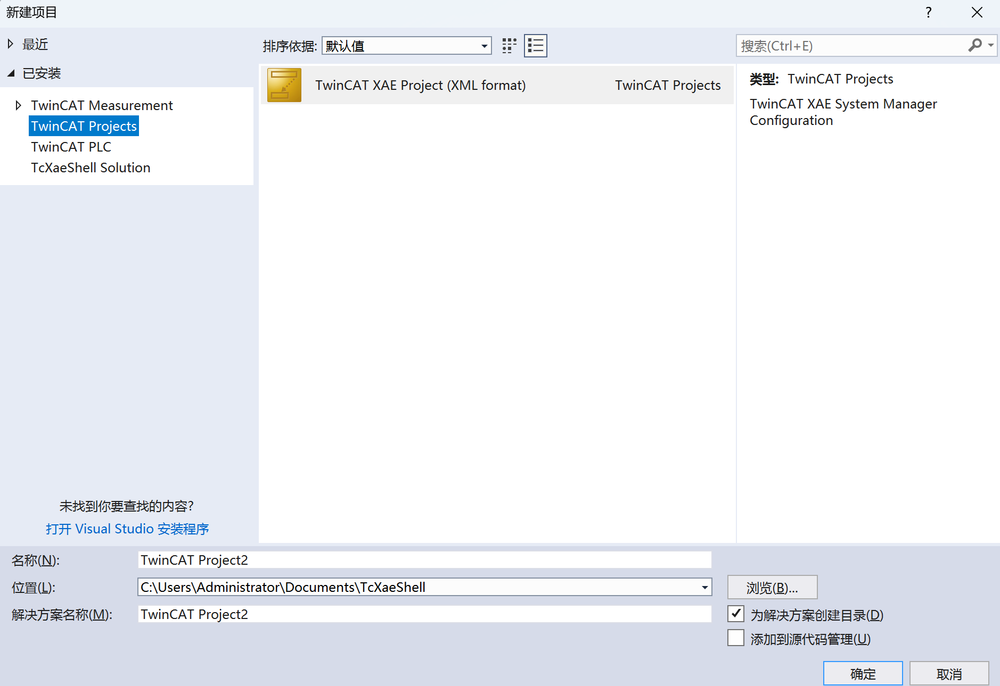
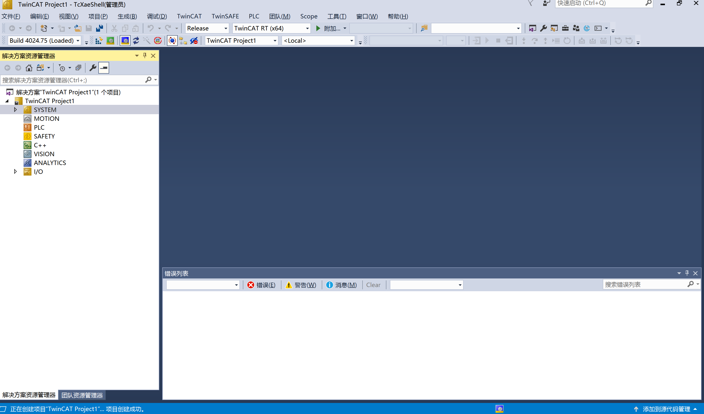
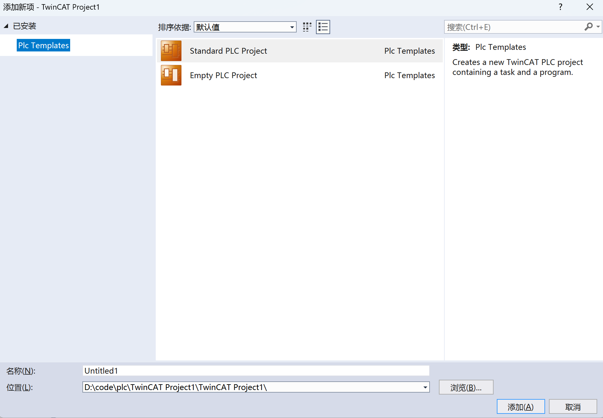
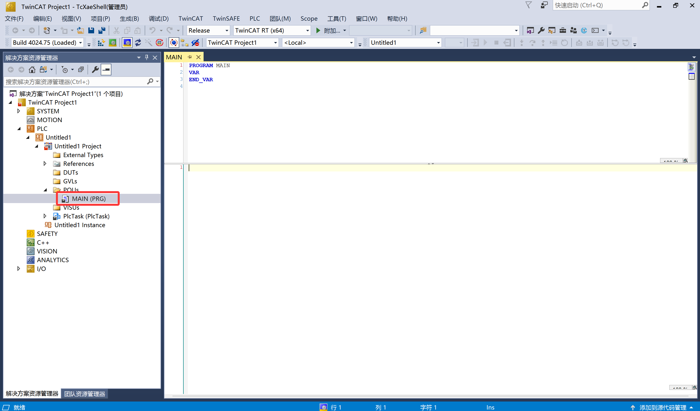
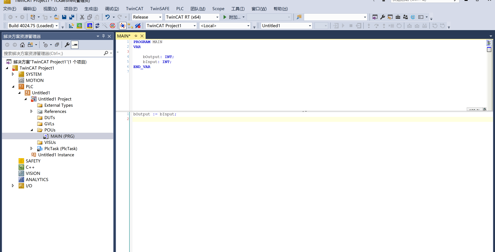
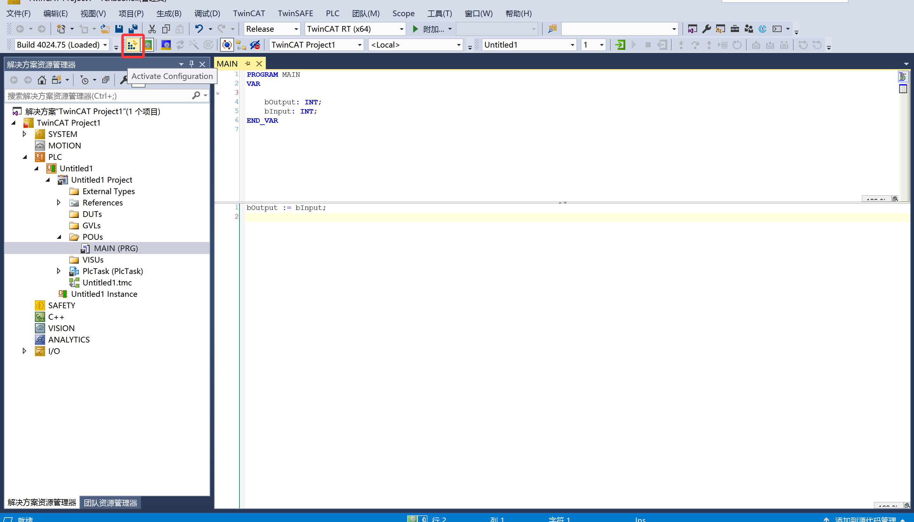
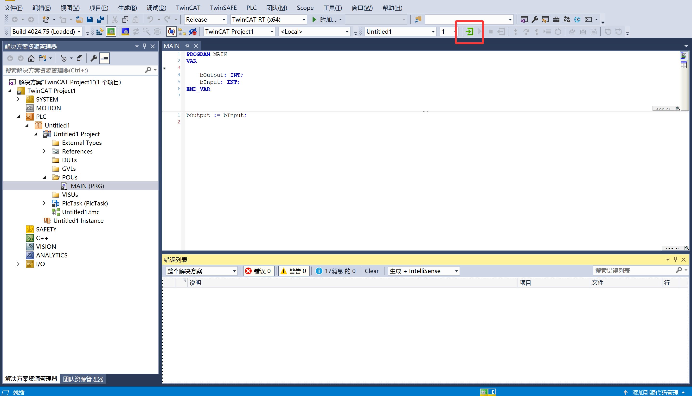

## 创建第一个 PLC 程序

安装完成 TwinCAT 3 后，桌面右下角系统托盘中会出现 TwinCAT 图标。单击该图标，即可打开开发环境。

在弹出菜单中点击 **TwinCAT XAE (TcXaeShell)**，即可进入编程主界面。打开后，选择新建项目。

到这里，第一个 PLC 项目就成功创建了。关于项目中每个文件的具体含义与作用，我们将在下一篇文章中详细讲解。

接下来，我们需要在 PLC 项目下添加新项。右键点击 **PLC** 文件夹，选择添加新项。

此时会出现两种添加方式：第一种会同时引入一些常用的标准库，适合大多数场景；第二种则为完全空白的程序，不添加任何库。这里我们选择第一种即可。

添加完成后，可以看到程序的入口文件，即默认生成的 MAIN（主程序块）。

至此，第一个 PLC 程序的结构已经搭建完成。

接下来需要激活配置。点击菜单栏中的激活配置按钮，在弹出的对话框中一路选择“OK”，将系统切换为运行模式。

激活完成后，点击同一位置的绿色三角按钮（启动按钮），即可运行程序。

<video controls src="./videos/video.mp4" title="PLC程序运行演示"></video>

从视频中可以看到，当我们将输入值修改为 `3` 后，输出值同步变为 `3`，程序逻辑正确执行。至此，第一个 PLC 程序成功运行！

在首次运行的时候，可能会遇到虚拟化相关的问题，我们只需要到windows功能，把关于虚拟化的内容全部关掉。
- Hyper-V
- 虚拟机平台 (Virtual Machine Platform)
- Windows 虚拟机监控程序平台 (Windows Hypervisor Platform)
- Windows 沙盒