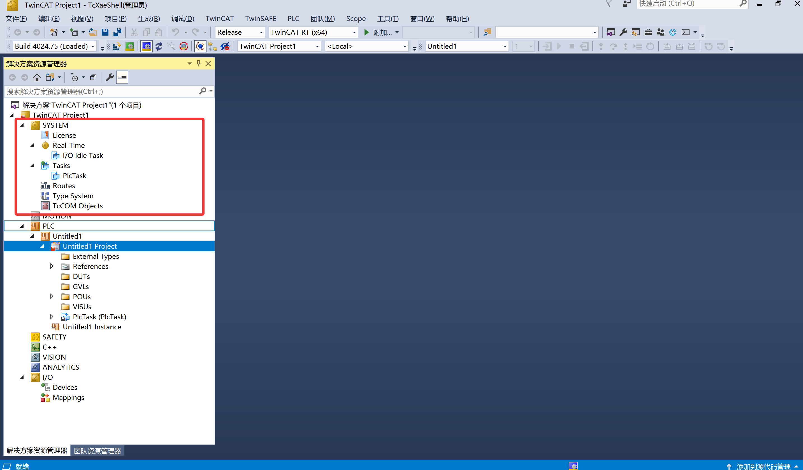
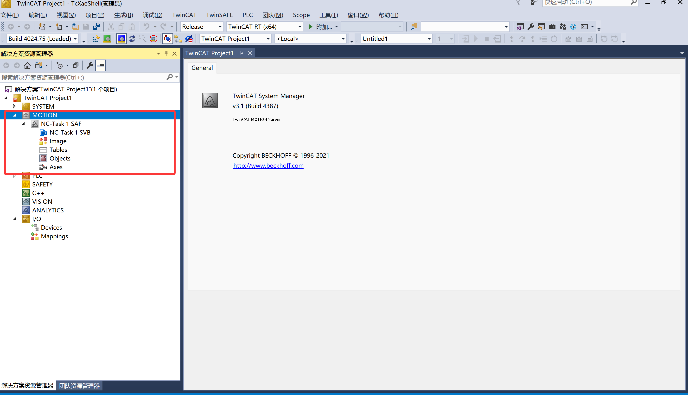

- [认识TwinCat3](#认识twincat3)
  - [TwinCAT 3 项目 SYSTEM 文件夹子项说明](#twincat-3-项目-system-文件夹子项说明)
    - [📌 补充说明](#-补充说明)
  - [TwinCAT 3 项目中的 MOTION 文件夹详解](#twincat-3-项目中的-motion-文件夹详解)
    - [📁 位置](#-位置)
    - [🎯 一句话解释](#-一句话解释)
    - [📂 子文件夹/对象逐项说明](#-子文件夹对象逐项说明)
      - [1. **Axes（轴列表）** ⭐⭐⭐](#1-axes轴列表-)
  - [TwinCAT 3 项目中的 PLC 文件夹详解](#twincat-3-项目中的-plc-文件夹详解)
    - [📁 位置](#-位置-1)
    - [🎯 一句话解释](#-一句话解释-1)
    - [📂 子文件夹/对象逐项说明](#-子文件夹对象逐项说明-1)
      - [1. **POUs（程序组织单元）** ⭐⭐⭐](#1-pous程序组织单元-)
  - [TwinCAT 3 项目中的 I/O 文件夹详解](#twincat-3-项目中的-io-文件夹详解)
    - [📁 位置](#-位置-2)
  - [🎯 一句话解释](#-一句话解释-2)
    - [📂 子文件夹/对象逐项说明](#-子文件夹对象逐项说明-2)
      - [1. **Devices（设备列表）** ⭐⭐⭐](#1-devices设备列表-)

## 认识TwinCat3

SYSTEM文件夹 = 汽车的仪表盘和设置菜单

**`SYSTEM` 文件夹 = PLC项目的"控制面板/系统设置"**

它不存放您写的程序代码，而是存放"这个PLC项目该怎么运行"的各种配置。

### TwinCAT 3 项目 SYSTEM 文件夹子项说明

| 子文件夹 | 核心作用 | 通俗理解 | 使用频率 | 什么时候会用到 |
| :--- | :--- | :--- | :--- | :--- |
| **License** | 查看和管理 TwinCAT 授权状态 | “软件激活状态”——看功能有没有开通 | ⭐ 偶尔 | 提示“缺少授权”或“试用期快到了”时查看 |
| **Real-Time** | 实时内核性能与 CPU 亲和性设置 | “CPU 算力分配”——给 PLC 分配多少计算资源 | ⭐ 很少 | 程序卡顿、实时性报错，或要绑核优化时才调 |
| **I/O Idle Task** | I/O 空闲任务配置（后台轮询） | “后台待机任务”——不忙的时候干啥 | ⭐ 基本不动 | 几乎不用改，除非要调整 I/O 刷新时机 |
| **Tasks** | **任务周期配置（核心）** | “PLC 的思考节奏”——多久执行一次程序 | ⭐⭐⭐ 常用 | 新建项目后，确认或修改任务周期（如 10ms） |
| **PlcTask** | 当前 PLC 任务实例的具体设置 | 就是这个 PLC 任务的“属性面板” | ⭐⭐ 偶尔看 | 查看任务绑定、优先级或关联的 I/O 组 |
| **Routes** | 路由与通信路径配置 | “网络地址簿”——告诉 PLC 怎么和其他设备通信 | ⭐⭐ 用到时配置 | 需要和上位机、触摸屏或其它 PLC 通信时 |
| **Type System** | 全局数据类型管理（结构体、枚举等） | “字典”——存放自定义的结构体、枚举、联合体 | ⭐⭐ 定义类型时用 | 定义 DUT（如气缸状态结构体）时自动出现 |
| **TcCOM Objects** | TwinCAT 通信对象管理 | “接口管理器”——管理模块间的通信接口 | ⭐ 高级功能时才用 | 使用 OPC UA、Modbus 或自定义通信模块时 |

---

#### 📌 补充说明

- **初学者重点关注**：`Tasks`（确认周期）、`Type System`（自定义数据类型）、`Routes`（通信时才动）。
- **其他子项**（如 `Real-Time`、`I/O Idle Task`）在大多数中小型项目中**保持默认即可**，无需修改。
- `PlcTask` 是 `Tasks` 下的一个具体实例，通常你点进 `Tasks` 就能看到它，它继承了任务周期设置。

> ✅ **经验之谈**：SYSTEM 文件夹就像汽车的仪表盘，日常开车（写逻辑）基本不碰，但遇到“故障灯亮”（报错/性能问题）时，知道去哪看就很关键。

### TwinCAT 3 项目中的 MOTION 文件夹详解

#### 📁 位置
在 TwinCAT 3 项目树中，`MOTION` 文件夹位于 `SYSTEM` 文件夹下方，与 `PLC`、`I/O` 等平级，是专门用于**运动控制（Motion Control）** 功能的配置中心。

---

#### 🎯 一句话解释
**`MOTION` = PLC项目的"运动控制系统总控台"**

它负责管理和配置所有与**电机、伺服轴、机器人**等运动控制相关的对象和任务。

---

#### 📂 子文件夹/对象逐项说明

根据您的截图，`MOTION` 文件夹下包含以下子项：

| 子项 | 作用 | 通俗理解 | 使用频率 |
| :--- | :--- | :--- | :--- |
| **NC-Task1 SAF** | 安全运动控制任务（Safe Motion） | "安全保镖" - 负责监控运动过程中的安全功能（如安全限位、安全停止） | ⭐⭐ 用到安全功能时配置 |
| **NC-Task1 SVB** | 标准运动控制任务（Standard Motion） | "运动指挥官" - 负责常规的轴运动控制（定位、速度、插补等） | ⭐⭐⭐ 核心配置，常用 |
| **Images** | 凸轮表/轮廓表（Cam Tables） | "运动图谱" - 存储电子凸轮、联动曲线等 | ⭐⭐ 用到电子凸轮时配置 |
| **Tables** | 数据表配置 | "参数台账" - 存储各种运动参数表（如 S 曲线加减速参数） | ⭐ 高级功能时才用 |
| **Objects** | 运动控制对象集合 | "工具库" - 存放各种运动控制相关的配置对象 | ⭐ 进阶配置时用 |
| **Axes** | 轴对象列表 | "电机列表" - 列出项目中的所有伺服/步进轴 | ⭐⭐⭐ 最常用！每个电机都在这里配置 |

---

##### 1. **Axes（轴列表）** ⭐⭐⭐
这是 **MOTION 里最重要的文件夹**！

- 每一个物理电机，在这里对应一个 **轴对象（Axis Object）**
- 在这里配置轴的**软限位、速度、加速度、回零方式、单位换算**等物理参数

### TwinCAT 3 项目中的 PLC 文件夹详解

#### 📁 位置
在 TwinCAT 3 项目树中，`PLC` 文件夹位于 `MOTION` 文件夹下方，是您**编写和存放所有 PLC 程序代码**的核心位置。

---

#### 🎯 一句话解释
**`PLC` 文件夹 = 您的"程序代码仓库"**

这里存放着您写的所有 PLC 程序、功能块、数据类型定义、全局变量等。您在 `MAIN` 里写的代码，就是放在这里的 `POUs` 文件夹下。

---

#### 📂 子文件夹/对象逐项说明

根据您的截图，`PLC` 文件夹下包含以下子项：

| 子项 | 作用 | 通俗理解 | 使用频率 |
| :--- | :--- | :--- | :--- |
| **Untitled1Project** | PLC 项目名称（您创建时命名的） | "整个代码仓库的总文件夹" | ⭐⭐⭐ 这是根，一直都在 |
| **External Types** | 外部数据类型引用 | "别人家借来的字典" - 引用其他库或系统提供的数据类型 | ⭐⭐ 用到外部库时才看 |
| **References** | 引用的库文件列表 | "借来的工具箱" - 列出了项目用了哪些标准库（如 Tc2_Standard） | ⭐⭐⭐ 添加/管理库时用 |
| **DUTs** | 自定义数据类型（Data Unit Types） | "自建字典" - 存放您自己定义的结构体、枚举、联合体 | ⭐⭐ 定义复杂数据时用 |
| **GVLs** | 全局变量列表（Global Variable Lists） | "公共公告板" - 存放所有程序都能访问的全局变量 | ⭐⭐⭐ 常用！放全局参数 |
| **POUs** | 程序组织单元（Program Organization Units） | "您的程序代码本体" - 存放所有程序、功能块、函数 | ⭐⭐⭐ 最核心！天天在这写代码 |
| **VISUs** | 可视化界面（Visualization） | "HMI 界面设计" - 存放触摸屏/上位机界面文件 | ⭐⭐ 需要自带 HMI 时才用 |
| **PlcTask (PlcTask)** | PLC 任务实例 | "程序运行引擎" - 关联到 SYSTEM → Tasks 里的任务设置 | ⭐⭐ 看任务属性和周期 |
| **Untitled1 Instance** | PLC 实例 | "程序的运行实例" - 这个 PLC 项目在 TwinCAT 中的运行实例 | ⭐⭐ 调试/监控时用 |

---

##### 1. **POUs（程序组织单元）** ⭐⭐⭐
**这是您写代码的地方！**

### TwinCAT 3 项目中的 I/O 文件夹详解

#### 📁 位置
在 TwinCAT 3 项目树中，`I/O` 文件夹位于 `ANALYTICS` 文件夹下方，是**配置所有物理输入输出设备**的核心位置。

---

### 🎯 一句话解释
**`I/O` 文件夹 = 您的"硬件接线总控台"**

这里负责管理所有与 PLC 连接的**物理硬件设备**，包括数字量输入/输出模块、模拟量模块、伺服驱动器、现场总线从站等。您编写的 PLC 程序中的变量，就是通过这里与真实的物理信号进行连接的。

---

#### 📂 子文件夹/对象逐项说明

根据您的截图，`I/O` 文件夹下包含以下子项：

| 子项 | 作用 | 通俗理解 | 使用频率 |
| :--- | :--- | :--- | :--- |
| **Devices** | 所有 I/O 设备的列表 | "硬件清单" - 列出项目中所有的硬件设备 | ⭐⭐⭐ 核心配置，常用 |
| **Mappings** | 变量映射关系总览 | "接线对照表" - 显示 PLC 变量与物理 IO 点的对应关系 | ⭐⭐ 查看/调试时用 |

---

##### 1. **Devices（设备列表）** ⭐⭐⭐
**这是 I/O 配置的核心！**

在 `Devices` 下，您会看到：
